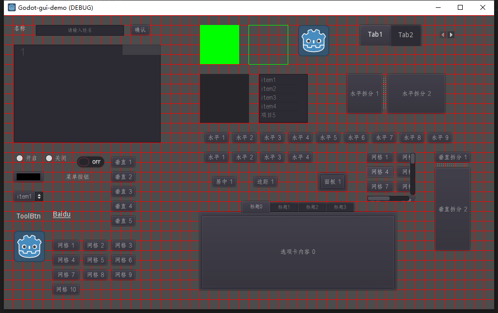

## godot-gui-demo
- godot的组件和容器使用demo

## 文档
1. [基础类型](doc/1基础类型.md)
2. [基础绘制](doc/2基础绘制.md)
3. [控件基础](doc/3控件基础.md)
4. [文本输入](doc/4文本输入.md)
5. [按钮](doc/5按钮.md)
6. [背景与边框](doc/6背景与边框.md)
7. [简单容器](doc/7简单容器.md)
8. [布局容器](doc/8布局容器.md)

## 效果
